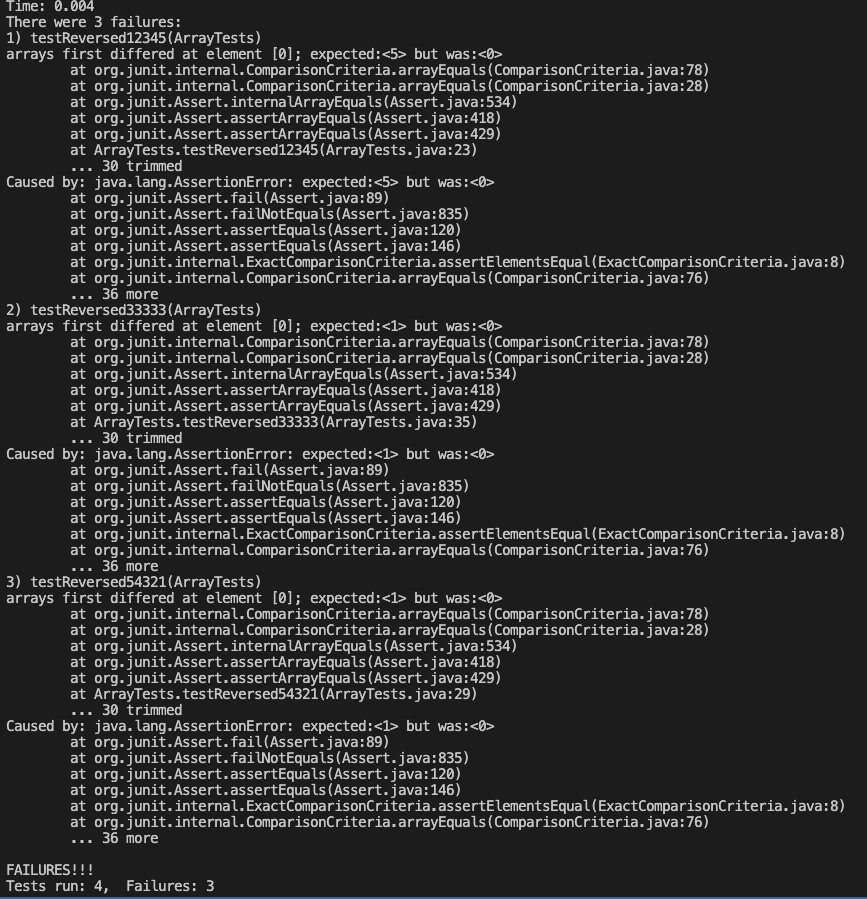
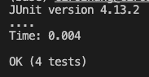

# Question 1: Bugs

We will looks that the bug in the reversed method of the ArrayExamples class

* input: {1, 2, 3, 4, 5} --> excepted output: {5, 4, 3, 2, 1}
```
@Test
public void testReversed12345() {
    int[] input = {1, 2, 3, 4, 5};
    int[] output = {5, 4, 3, 2, 1};
    assertArrayEquals(output, ArrayExamples.reversed(input));
}
```
JUnit test will fail

* input: {0, 0, 0, 0, 0} --> excepted output: {0, 0, 0, 0, 0}
```
@Test
public void testReversed00000() {
    int[] input = {0, 0, 0, 0, 0};
    int[] output = {0, 0, 0, 0, 0};
    assertArrayEquals(output, ArrayExamples.reversed(input));
}
```
JUnit test will pass

* Here we added two additional test methods
1. testReversed33333: input = {3, 3, 3, 3, 3}
2. testReversed54321: input = {5, 4, 3, 2, 1}
<br>



<br>

Here we see with our Junit result that testReversed12345, testReversed33333, and testReversed54321 all failed to pass the assert
AssertArrayEquals also gave us the symptom of each: 
1. testReversed12345: first index of output should be 5, but instead we got 0.
2. testReversed33333: first index of output should be 3, but instead we got 0.
3. testReversed54321: first index of output should be 1, but instead we got 0.
<br>

* The Bug our orginal code as was that it tried to assigned the reverse values of newArray to arr instead of the other way arround. And because of this bug, our output will be a array with only zeros regardless of the input
  
  
Original Code with bug
```
static int[] reversed(int[] arr) {
    int[] newArray = new int[arr.length];
    for(int i = 0; i < arr.length; i += 1) {
      arr[i] = newArray[arr.length - i - 1];
    }
    return arr;
  }
```

<br>

New Code without bug
```
static int[] reversed(int[] arr) {
    int[] newArray = new int[arr.length];
    for(int i = 0; i < arr.length; i += 1) {
      newArray[i] = arr[arr.length - i - 1];
    }
    return newArray;
  }
```
<br>
Junit Passes



<br>

Knowing the bug, it was a pretty easy fix. All we have to do is swap arr and newArray
1. Line 4: swap arr and newArray so we can have the reverse values of arr assigned to newArray
2. Line 6: return newArray instead of arr

<br>

# Question 2: Researching Commands

* For this question we will look at the grep command. 
* Sources: geeksforgeeks
* Link: https://www.geeksforgeeks.org/grep-command-in-unixlinux/

1. grep -c

```
(base) cirozhang@Ciros-MBP-2 technical % grep -c "is" biomed/rr37.txt
157
```

we see here by using "-c" and "is" to search for a specific file. grep returns us a number of lines where "is" is repeated in our file. This can be very useful if we didnt care for the overall content of our file and just want to quickly know how much lines contains our word 

```
(base) cirozhang@Ciros-MBP-2 technical % grep -c "scientific community" plos/*.txt
... (parts omitted) ...
plos/pmed.0020242.txt:0
plos/pmed.0020246.txt:0
plos/pmed.0020247.txt:0
plos/pmed.0020249.txt:0
plos/pmed.0020257.txt:0
plos/pmed.0020258.txt:0
plos/pmed.0020268.txt:0
plos/pmed.0020272.txt:0
plos/pmed.0020273.txt:0
plos/pmed.0020274.txt:0
plos/pmed.0020275.txt:0
plos/pmed.0020278.txt:0
plos/pmed.0020281.txt:1
```

we see here by using "-c" and "scientific community" to search for multiple files. grep returns us the file name and directory followed by a number of the amount of lines "scientific community" appears for that files. So unlike before this tells us the information of multiple files. This could be very usefull if we are just looking for amount of lines in the files that match our search and we dont care about the content. 

2. grep -l

```
(base) cirozhang@Ciros-MBP-2 technical % grep -l "is" biomed/rr37.txt              
biomed/rr37.txt
```

we see here by using "-l" and "is" to search for a specific file. grep returns that file name if it contains 'is'. In this case it returns biomed/rr37.txt telling us it contain our search of the word "is". In this case this could be useful if we want to confirm if a certain file contains the word we are searching for. 

```
(base) cirozhang@Ciros-MBP-2 technical % grep -l "scientific community"  plos/*.txt
plos/journal.pbio.0020001.txt
plos/journal.pbio.0020105.txt
plos/journal.pbio.0020161.txt
plos/journal.pbio.0020214.txt
plos/journal.pbio.0020430.txt
plos/pmed.0020035.txt
plos/pmed.0020036.txt
plos/pmed.0020281.txt
```

we see here by using "-l", and "scientific community" to search for multiple files. grep returns the list of file names that matches our search rather than the contents inside. 
Although the single search may not be as useful, this one definely is. In this case, it could be very usefull if we are just looking for specific file names that match our search. 


3. grep -i

```
cirozhang@Ciros-MBP-2 technical % grep -i  "is" biomed/rr37.txt
        ... (parts omitted) ...
        subscale, one point is assigned for each medication used
        frequent inhaled beta agonist or corticosteroid use.
        by factor analysis [ 32], which measure physical and
```
With "-i" we see that we were able the find the lines containing our pattern regardless of the capitcalization. In this case when we search for "is", grep returns the places where our word "is" appears regardless of the capitcalization. This could be really useful if we want our grep search to ignore captical cases and fine the files were we otherwise wouldn't be able to. 


```
cirozhang@Ciros-MBP-2 technical % grep -i  "IS" biomed/rr37.txt
        ... (parts omitted) ...
        subscale, one point is assigned for each medication used
        frequent inhaled beta agonist or corticosteroid use.
        by factor analysis [ 32], which measure physical and
```

Here we see when we search for the same file but with "IS", grep returns the same result. In this case it ignores all captical cases and still returns the lines where "IS" is lowercase "is". As mentioned before, this could be really useful if we want our grep search to ignore captical cases and fine the files were we otherwise wouldn't be able to. 


4. grep -h

```
(base) cirozhang@Ciros-MBP-2 technical % grep -h  "USA" biomed/rr37.txt
        in the USA [ 1]. The mortality rate from asthma has risen
          (SAS Institute, Cary, NC, USA). We evaluated the
        sharply in the USA since the late 1970s [ 2].
        increasing in the USA and around the world, the minority of
```

With "-h" we see that grep will only return the lines where our search is found, ignoring the file name. This could be very useful if we only want the the contains of were our pattern appears rathers and dont care about which file its from. In this case with "USA", it help us display the place the lines that contains "USA" while saving the space of repeating the file name that where its from. 

```
(base) cirozhang@Ciros-MBP-2 technical % grep -h "scientific community"  plos/*.txt 
        the world scientific community closer to each other (Annan 2003). Mr. Annan stressed the
        serious problems not only for the scientific community in the developing countries, but for
        scientific community? We used SCI 2001 data to examine the proportion of publications in
        impact in the international scientific community and is underrepresented in the top
        independently are making important contributions to the international scientific community,
        dialogue—a development undoubtedly in the interest of the scientific community, regardless
        The scientific community should lead an ERC, says Larrouturou, ‘but I do not like the idea
        that this should be completely under the guidance and wisdom of the scientific community
        Abrikosov's repeated exhorations to the scientific community “to help all the talented
        scientific community has targeted clinical applications, such as neuroprostheses for
        global scientific community. But its success cannot be taken for granted and will come too
        effort should be commended for providing a great service to the scientific community. It is
        of the scientific community at large.
        from the scientific community and whose incomplete findings cause injury; and
```

Here when we do "-h" but on multiple files, the same thing happens. Our search does not tell us which file these lines that contains are from. It display only these lines which could save us space and make thing look nicer. So in this case, it could be very useful when we only want a collection of when our patterns appears in our files, while not caring of where they orginated from. 


    
