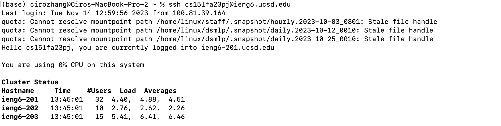
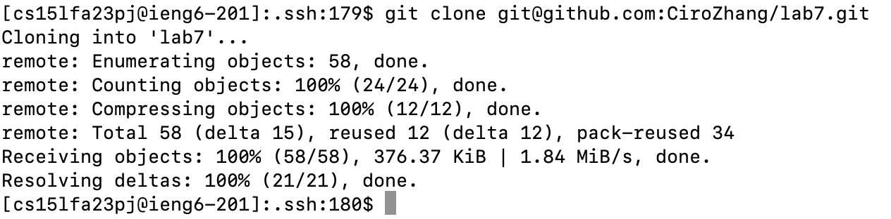
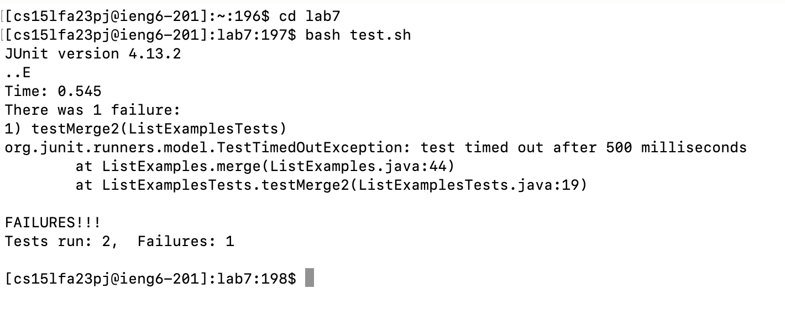
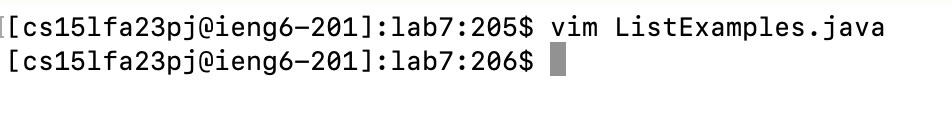
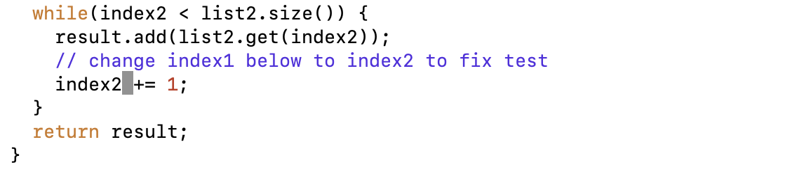
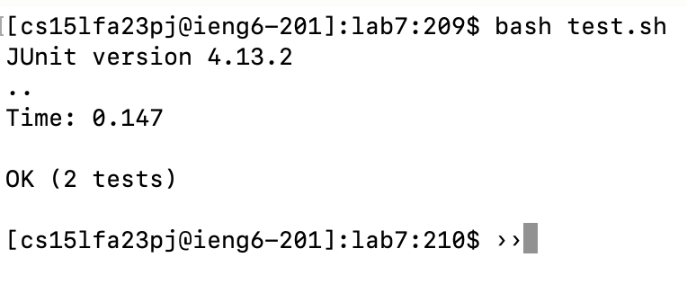
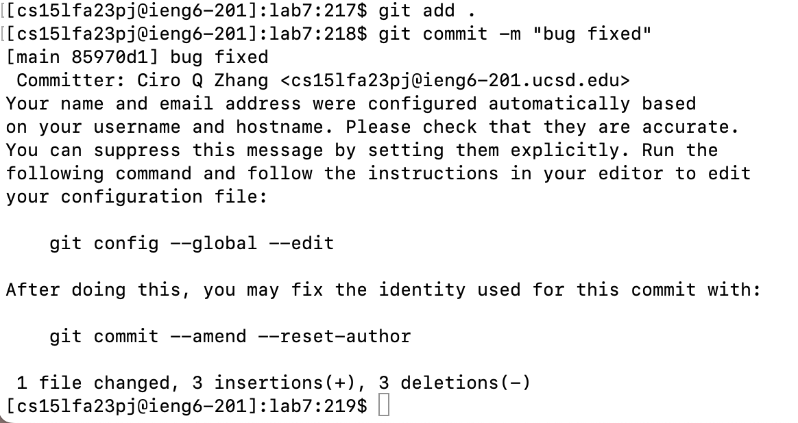
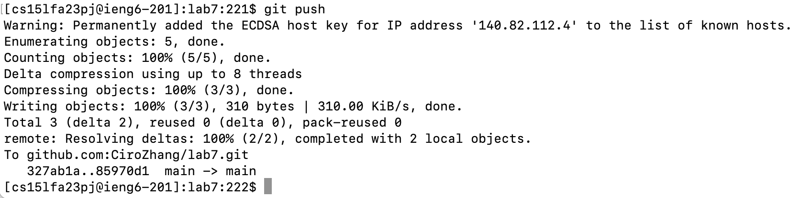

# Task 4: Log into ieng6

<Ctrl + r> s \<enter>

* I search for it in my past commands with control + r and "s".
* In this case the first one that pops up is: "ssh cs15lfa23pj@ucsd.edu"
* So i pressed enter to run command and Log into ieng6

# Task 5: Clone your fork of the repository from your Github account

<Ctrl + r> git cl \<enter>

* here I searched up my past commands using control + r and "git cl"
* In this case the first command that pop up was :"git clone git@github.com:CiroZhang/lab7.git"
* So I press enter and run this command and clone the repository

# Task 6: Run the tests, demonstrating that they fail

cd l \<tab> \<enter> 

* Here I first change by directory into the lab7 folder.
* "l" and \<tab> auto filled "lab7" so i didnt have to type the name of the directory
* I was able to get: "cd lab7"
* So I press enter and run this command and change the directory to lab7

<Ctrl + r> ba \<enter>

* here I rearched up my past command using control + r and "ba"
* In this case the first command that pop up was : "bash test.sh"
* So I press enter and run this bash script or run the tests. Which outputs they fail

# Task 7: Edit the code file to fix the failing test

vim L \<tab> . \<tab> \<enter>

* here I am trying the use the vim command on the file i am trying to edit.
* "L" + tab here autofiled: "ListExamples" 
* "." + tab autofiled: ".java".
* I was able to get: vim ListExamples.java
* So I press enter and run this command to use vim on ListExamples.java to make edits 
   

/ i n d e x 1 <space> + \<enter> n e \<right arrow>  i \<delete> 2 \<esc> : x

* here "/index1 +" locates the place where "index1 +" appears after i press enter
* here I press "n" because I am trying to skip to the second time "index1 +" appears in the file, which brings my curser to the front of "index1" or "i"
* I press "e" to bring my curser to the end of "index1" bring my curser to "1"
* I press right arrow so that my curser is now behind "1" 
* I press "i" so i can now start editing the file.
* I press "delete" so I delete the "1" and then I press 2 replace it with "2"
* Lastly I press escape + ": x" with stops the edits and exits the file while saving the edits. 

# Task 8: Run the tests, demonstrating that they now succeed

<Ctrl + r> ba \<enter>

* Since I already did the same command in task 6, I rearched up my past command using control + r and "ba"
* the first one that showed up was: "bash test.sh"
* I press enter to run this bash script with tells me that the edit code had passed the test

# Task 9: Commit and push the resulting change to your Github account 

<Ctrl + r> git a \<enter>

* First I search up "git a" with <Ctrl + r>, which gets me "git add ."
* Since I used "." it adds all changes in the current directory, which in this case is our edits of "ListExamples.java"
* which I then press enter to run, adding my edits.
  
<Ctrl + r> git co \<enter>

* Second I search up "git co" with <Ctrl + r>, which gets me "git commit -m "bug fixed""
* Since I used "-m "bug fixed"", it includes the commit message "bug fixed" within the same command, without opening a text editor
* which I then press enter to run, commiting the message "bug fixed" to  my edits. 

<Ctrl + r> git p\<enter>

* Lastly I search up "git p" with <Ctrl + r>, which gets me "git push""
* which I then press enter to run, pushing my edits to github

