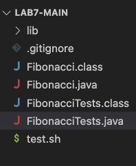

# Part 1: Debugging Scenario

## Question 1: Original Post by Student

Title: Issue with Java Program Output

Hi everyone,

I'm having a strange issue with my Fiboncci.java program. I'm supposed to print the Fibonacci sequence up to a given number, but I am getting this strange error. I am not sure what I did wrong. 

Here's a screenshot of the error when I run my unit tests:


(lines omitted) 


I have also attached all the files I have been working on. Please let me know what I did wrong


## Original code

* Fibonacci.java 
```
public class Fibonacci {
    public static int fib(int n) {
        if (n == 0)
            return 0;
        else
            return fib(n-1) + fib(n-2);
    }
}
```

* FibonacciTests.java
```
public class FibonacciTests {
    @Test
    public void testFirst10() {
        int n = 10; 
	    int[] answers = {0, 1, 1, 2, 3, 5, 8, 13, 21, 34};
        for (int i = 0; i < n; i++) {
            assertEquals(answers[i], Fibonacci.fib(i));
        }
    }
}
```

* test.sh
```
javac -cp .:lib/hamcrest-core-1.3.jar:lib/junit-4.13.2.jar *.java
java -cp .:lib/hamcrest-core-1.3.jar:lib/junit-4.13.2.jar org.junit.runner.JUnitCore FibonacciTests
```

## Part 2: Response from a TA 

Hi (student name), 

It looks like you are trying you are trying to do the problem recussively, which is a great idea.
The "StackOverflowError" message you recieved, means that you have enters a infinite recurssion with FibonacciTests.java

Instead of testing the first 10 sequence, lets decreases that to just the first two, n = 0 and n = 1. 
You will see that one of them will fail. Try debugging the one that fails and look closely to how you are calling the function again recussive. 

Hope this helps and let me know if you still have any questions. 


## Part 3: Response from Student 

Oh I see the issue,

I added the two new tests and I see when n = 0, the programs passes, but it run into the error when n is greater than 0. 


(lines omitted) 


When I debugged the error I notice that is was because of the fib(n-2) part of my recussions, since when n = 1, fib(1 - 2) creates a recussion when n = -1. This means that the recussion with never be stop by my if statmet as n continue to get smaller than 0. 

So I change the condition of my if statment and now the recussion works properly. 


Thank you so much for the help

## New code

* Fibonacci.java (without error)
```
public class Fibonacci {
    public static int fib(int n) {
        if (n <= 1)
            return n;
        else
            return fib(n-1) + fib(n-2);
    }
}
```

* FibonacciTests.java (with two new tests) 
```
public class FibonacciTests {
    @Test
    public void testFirst() {
        assertEquals(0, Fibonacci.fib(0));
    }

    @Test
    public void testSecond() {
        assertEquals(1, Fibonacci.fib(1));
    }

    @Test
    public void testFirst10() {
        int n = 10; 
	    int[] answers = {0, 1, 1, 2, 3, 5, 8, 13, 21, 34};
        for (int i = 0; i < n; i++) {
            assertEquals(answers[i], Fibonacci.fib(i));
        }
    }
}
```

* test.sh (no edit) 
```
javac -cp .:lib/hamcrest-core-1.3.jar:lib/junit-4.13.2.jar *.java
java -cp .:lib/hamcrest-core-1.3.jar:lib/junit-4.13.2.jar org.junit.runner.JUnitCore FibonacciTests
```

* Directories


# Part 2 – Reflection

I felt like I learned much more during this quarter's second half than in the first half.

We come from zero prior experience with Vim or Bash. It was interesting to see what we could do with the two. 

For example, in the past, I have repeatedly typed out Javac (some files) and Java (some files) through terminal to run any Java file. Although it usually doesn't take that much of my time, it gets annoying when the number of Java files I am trying to run simultaneously increases. Bash scripts, in this case, give me a quick and easy solution. Throughout our labs in the second half of the quarter, everything we needed to test a file, all we had to do was "bash test.sh". Which was super convenient and something I will definitely continue to do moving forward in my coding journey. 

Another example was Vim. Vim, in this case, allows me to do quick edits through the command line. However, for bigger projects, I would definitely want to  VS code or Intellj. But Vim provides me with a quick alternative for quick and minor edits to files on my computer. And especially during our last skill demo, when all we did was make small edits to fix a file. I was able to use Vim to fix the bugs in less than a minute, while if I were to use, let's say, Intellj, I would have had to spend at least 1-2 minutes just to set everything up. 

I think overall, I really enjoy and learn a lot in our labs. I did feel that many times things went past really fast, and I wasn't really getting everything. But my lab classmate and tutor definitely did help me catch up from time to time. 
