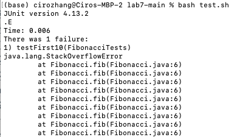
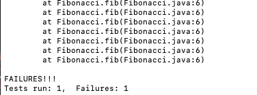
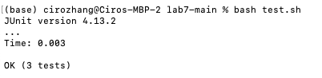

# Part 1: Debugging Scenario

## Original Post by Student

Title: Issue with Java Program Output

Hi everyone,

I'm having a strange issue with my Fiboncci.java program. I'm supposed to print the Fibonacci sequence up to a given number, but I am getting this strange error. I am not sure what I did wrong. 

Here's a screenshot of the error when I run my unit tests:



(lines omitted) 



I have also attached all the files I have been working on. Please let me know what I did wrong


## Original code

* Fibonacci.java (with error)
```
public class Fibonacci {
    public static int fib(int n) {
        if (n == 0)
            return 0;
        else
            return fib(n-1) + fib(n-2);
    }
}
```

* FibonacciTests.java
```
public class FibonacciTests {
    @Test
    public void testFirst10() {
        int n = 10; 
	    int[] answers = {0, 1, 1, 2, 3, 5, 8, 13, 21, 34};
        for (int i = 0; i < n; i++) {
            assertEquals(answers[i], Fibonacci.fib(i));
        }
    }
}
```

* test.sh
```
javac -cp .:lib/hamcrest-core-1.3.jar:lib/junit-4.13.2.jar *.java
java -cp .:lib/hamcrest-core-1.3.jar:lib/junit-4.13.2.jar org.junit.runner.JUnitCore FibonacciTests
```

## Response from a TA 

Hi (student name), 

It looks like you are trying you are trying to do the problem recussively, which is a great idea.
The "StackOverflowError" message you recieved, means that you have enters a infinite recurssion with FibonacciTests.java

Instead of testing the first 10 sequence, lets decreases that to just the first two, n = 0 and n = 1. 
You will see that one of them will fail. Try debugging the one that fails and look closely to how you are calling the function again recussive. 

Hope this helps and let me know if you still have any questions. 


## Response from Student 

Oh I see the issue,

I added the two new tests and I see when n = 0, the programs passes, but it run into the error when n is greater than 0. 


(lines omitted) 


When I debugged the error I notice that is was because of the fib(n-2) part of my recussions, since when n = 1, fib(1 - 2) creates a recussion when n = -1. This means that the recussion with never be stop by my if statmet as n continue to get smaller than 0. 

So I change the condition of my if statment and now the recussion works properly. 



Thank you so much for the help

## New code

* Fibonacci.java (without error)
```
public class Fibonacci {
    public static int fib(int n) {
        if (n <= 1)
            return n;
        else
            return fib(n-1) + fib(n-2);
    }
}
```

* FibonacciTests.java (with two new tests) 
```
public class FibonacciTests {
    @Test
    public void testFirst() {
        assertEquals(0, Fibonacci.fib(0));
    }

    @Test
    public void testSecond() {
        assertEquals(1, Fibonacci.fib(1));
    }

    @Test
    public void testFirst10() {
        int n = 10; 
	    int[] answers = {0, 1, 1, 2, 3, 5, 8, 13, 21, 34};
        for (int i = 0; i < n; i++) {
            assertEquals(answers[i], Fibonacci.fib(i));
        }
    }
}
```

* test.sh (no edit) 
```
javac -cp .:lib/hamcrest-core-1.3.jar:lib/junit-4.13.2.jar *.java
java -cp .:lib/hamcrest-core-1.3.jar:lib/junit-4.13.2.jar org.junit.runner.JUnitCore FibonacciTests
```

