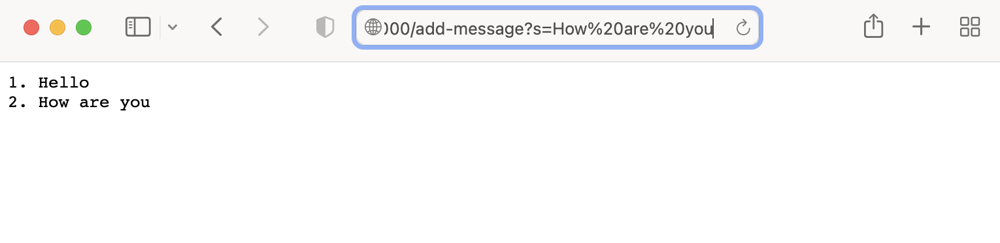
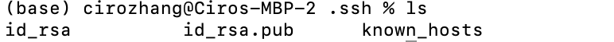

# Question 1: 

## StringServer.class

```
package wavelet;
import java.io.IOException;
import java.net.URI;

class Handler implements URLHandler {
    // The one bit of state on the server: a number that will be manipulated by
    // various requests.
    String text = "";
    int num = 0;
    public String handleRequest(URI url) {
        if (url.getPath().equals("/")) {
            return text;
        } else {
            if (url.getPath().contains("/add-message")) {
                String[] parameters = url.getQuery().split("=");
                System.out.println(parameters[0]);
                if (parameters[0].equals("s")) {
                    num ++;
                    text += String.format("%d. ", num) + parameters[1] + "\n";
                    return text;
                }
            }
            return "404 Not Found!";
        }
    }
}
class StringServer {
    public static void main(String[] args) throws IOException {
        if(args.length == 0){
            System.out.println("Missing port number! Try any number between 1024 to 49151");
            return;
        }
        int port = Integer.parseInt(args[0]);
        Server.start(port, new Handler());
    }
}
```
## /add-message?s=Hello

* If we ignore the methods called by Server.java when we started the server, the method call by StringServer is HandleRequest inside of the class Handler. Which help us add the message. 
* The relevant argument to those method HandleRequest is the url. So in this case it will be a new Java URI at URI(http://localhost:4000/add-message?s=Hello). There are two class field for the class, which is text, which stores the text that will be showned on the website and starts our empty, and num, which is the number of text we added
* After this HandleRequest is called, num is now 1 and text contains "1. Hello \n"

## /add-message?s=How are you

* If we ignore the methods called by Server.java when we started the server, the method call by StringServer is HandleRequest inside of the class Handler. Which help us add the message. 
* The relevant argument to those method HandleRequest is the url. So in this case it will be a new Java URI at URI(http://localhost:4000/add-message?s=Hello). There are two class field for the class, which is text, which stores the text that will be showned on the website and by this point only sorts "1. Hello \n", and num, which is the number of text we added. Which at this point is 1. 
* After this HandleRequest is called, num is now 2 and text contains "1. Hello \n 2. How are you \n"

# Question 2:


* The path to the private ssh key: /Users/cirozhang/.ssh/id_rsa
* The path to the public ssh key: /Users/cirozhang/.ssh/id_rsa.pub


