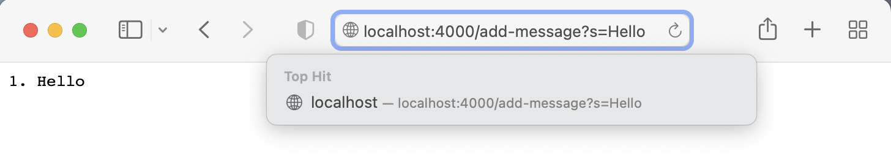

# Question 1: 

## StringServer.class

```
package wavelet;
import java.io.IOException;
import java.net.URI;

class Handler implements URLHandler {
    // The one bit of state on the server: a number that will be manipulated by
    // various requests.
    String text = "";
    int num = 0;
    public String handleRequest(URI url) {
        if (url.getPath().equals("/")) {
            return text;
        } else {
            if (url.getPath().contains("/add-message")) {
                String[] parameters = url.getQuery().split("=");
                System.out.println(parameters[0]);
                if (parameters[0].equals("s")) {
                    num ++;
                    text += String.format("%d. ", num) + parameters[1] + "\n";
                    return text;
                }
            }
            return "404 Not Found!";
        }
    }
}
class StringServer {
    public static void main(String[] args) throws IOException {
        if(args.length == 0){
            System.out.println("Missing port number! Try any number between 1024 to 49151");
            return;
        }
        int port = Integer.parseInt(args[0]);
        Server.start(port, new Handler());
    }
}
```
## /add-message?s=Hello

//
* Excluding the work that is done by Server.java, there is only one method in my code that gets called, which is HandleRequest inside of the class Handler.
* The relevant argument that gets passed to the method HandleRequest will be the url as a Java URI, so in this case a new URI(http://localhost:4000/add-message?s=Hello). There is only one class field for the class, which is an ArrayList<String> called arr, which starts out empty.
* After this HandleRequest is called, arr will now contain one String "Hello".
