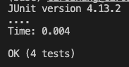

# Question 1: Bugs

We will looks that the bug in the reversed method of the ArrayExamples class

* input: {1, 2, 3, 4, 5} --> excepted output: {5, 4, 3, 2, 1}
```
@Test
public void testReversed12345() {
    int[] input = {1, 2, 3, 4, 5};
    int[] output = {5, 4, 3, 2, 1};
    assertArrayEquals(output, ArrayExamples.reversed(input));
}
```
JUnit test will fail

* input: {0, 0, 0, 0, 0} --> excepted output: {0, 0, 0, 0, 0}
```
@Test
public void testReversed00000() {
    int[] input = {0, 0, 0, 0, 0};
    int[] output = {0, 0, 0, 0, 0};
    assertArrayEquals(output, ArrayExamples.reversed(input));
}
```
JUnit test will pass

* Here we added two additional test methods
1. testReversed33333: input = {3, 3, 3, 3, 3}
2. testReversed54321: input = {5, 4, 3, 2, 1}
<br>


<br>

Here we see with our Junit result that testReversed12345, testReversed33333, and testReversed54321 all failed to pass the assert
AssertArrayEquals also gave us the symptom of each: 
1. testReversed12345: first index of output should be 5, but instead we got 0.
2. testReversed33333: first index of output should be 3, but instead we got 0.
3. testReversed54321: first index of output should be 1, but instead we got 0.
<br>

* The Bug our orginal code as was that it tried to assigned the reverse values of newArray to arr instead of the other way arround. And because of this bug, our output will be a array with only zeros regardless of the input
  
  
Original Code with bug
```
static int[] reversed(int[] arr) {
    int[] newArray = new int[arr.length];
    for(int i = 0; i < arr.length; i += 1) {
      arr[i] = newArray[arr.length - i - 1];
    }
    return arr;
  }
```

<br>

New Code without bug
```
static int[] reversed(int[] arr) {
    int[] newArray = new int[arr.length];
    for(int i = 0; i < arr.length; i += 1) {
      newArray[i] = arr[arr.length - i - 1];
    }
    return newArray;
  }
```
<br>
Junit Passes



<br>
