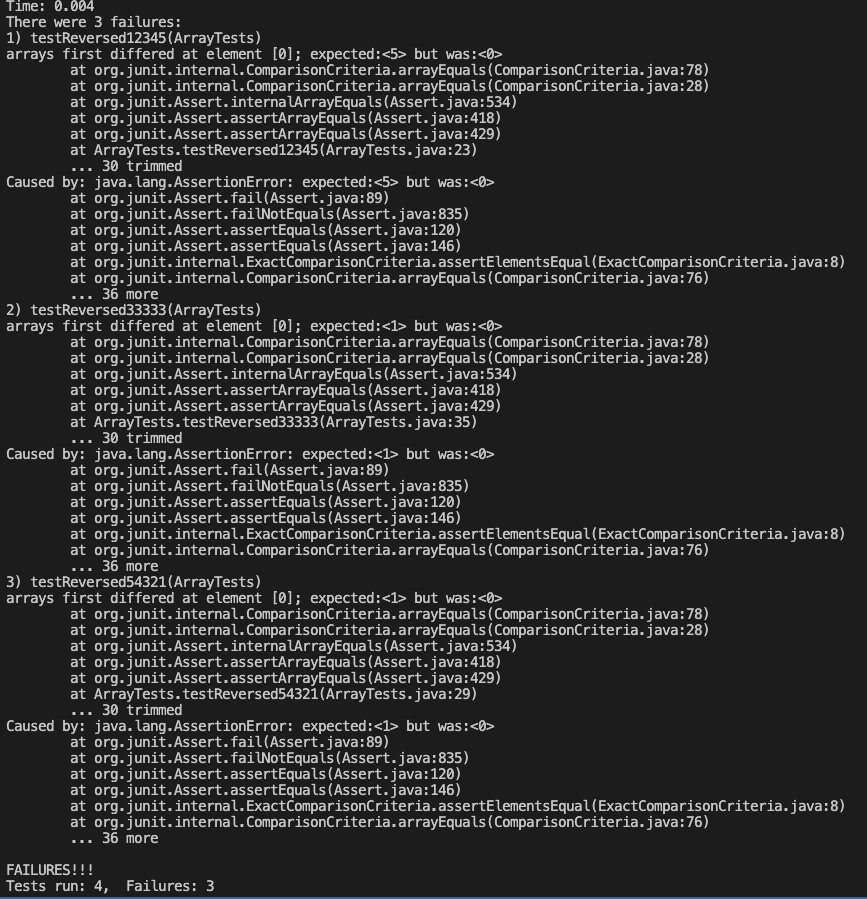

# Question 1: Bugs

We will looks that the bug in the reversed method of the ArrayExamples class

* input: {1, 2, 3, 4, 5} --> excepted output: {5, 4, 3, 2, 1}
```
@Test
public void testReversed12345() {
    int[] input = {1, 2, 3, 4, 5};
    int[] output = {5, 4, 3, 2, 1};
    assertArrayEquals(output, ArrayExamples.reversed(input));
}
```
JUnit test will fail

* input: {0, 0, 0, 0, 0} --> excepted output: {0, 0, 0, 0, 0}
```
@Test
public void testReversed00000() {
    int[] input = {0, 0, 0, 0, 0};
    int[] output = {0, 0, 0, 0, 0};
    assertArrayEquals(output, ArrayExamples.reversed(input));
}
```
JUnit test will pass

* Here we added two additional test methods
1. testReversed33333: input = {3, 3, 3, 3, 3}
2. testReversed54321: input = {5, 4, 3, 2, 1}
<br>

